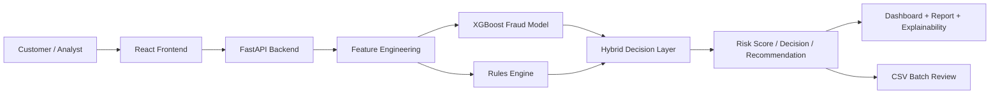

# ValliAI

ValliAI is a fraud-risk intelligence platform for digital transactions. It combines machine learning with rule-based fraud checks to assess whether a transaction is safe, risky, or needs extra verification before approval.

The project includes a React frontend, a FastAPI backend, and a trained fraud model that evaluates live transactions and batch CSV uploads. It is designed for both technical teams and business stakeholders who need to understand why a transaction was flagged.

## Why this project exists

Financial institutions, fintech products, and digital payment platforms need to catch suspicious activity quickly without blocking legitimate customers. ValliAI helps by:

- scoring each transaction in real time
- identifying risky patterns such as new devices, mismatched countries, unusual beneficiary activity, and abnormally large transfers
- explaining the main reasons behind a decision
- supporting batch review for analysts and operations teams
- blending AI-driven insights with fixed business rules for safer decisions

## Non-technical explanation

Think of ValliAI as an intelligent risk reviewer for payments.

When a customer makes a transaction, the system looks at details such as:

- transaction amount
- merchant type
- live location and home country
- device and account age
- recent transaction behavior
- beneficiary and session context

It then decides whether the transaction should be:

- approved normally
- monitored for later review
- sent for tougher authentication
- manually reviewed by an analyst
- declined or held for policy reasons

This helps reduce fraud losses while still giving legitimate customers a smooth checkout experience.

## Technical summary

ValliAI is built with:

- Frontend: React + Webpack
- Backend: FastAPI
- Model: XGBoost classifier trained on synthetic transaction data
- Rules engine: YAML-driven rule evaluation
- Explainability: SHAP-style feature importance and rule-hit explanations
- Data pipeline: feature engineering + batch CSV scoring

## Core features

- Single transaction scoring
- CSV batch upload scoring
- Risk score and decision output
- Explainability cards for model and rule drivers
- Decision summaries and recommended actions
- Risk dashboard with overview screens and reports
- Theme-aware, analyst-friendly UI
- Support for transactions flagged as low, medium, or high risk

## System architecture

The project is divided into two main parts:

1. Frontend application
   - React app for analysing transactions, reviewing risk results, and viewing explainability
   - Handles user flow, navigation, charts, and decision panels

2. Backend API
   - FastAPI service exposing transaction scoring endpoints
   - Combines model probability and rule-based checks into a final decision
   - Accepts CSV uploads for batch analysis



## Demo flow

A typical live demo can be shown in this order:

1. Log in to the dashboard and open the overview page
2. Enter or select a transaction scenario
3. Submit the transaction to the backend
4. View the generated risk score, decision, and recommended action
5. Review rule hits and model-based explanations
6. Open the reporting view for a deeper breakdown of flagged factors
7. Upload a CSV file to test batch scoring across many transactions

This flow helps users understand how the system moves from raw transaction data to a clear decision with reasons.

## Presentation summary

ValliAI is a fraud-risk decision support product that turns transaction data into clear risk decisions and human-readable explanations. Instead of showing only a score, it communicates why a payment was flagged and tells the user what action should follow.

For business teams, the value is simple:

- detect suspicious activity faster
- reduce losses from payment fraud
- keep customer friction low for safe transactions
- empower risk analysts with explainable outcomes
- support operational review with batch analytics

For technical teams, the system demonstrates how to combine:

- business logic rules
- feature engineering
- ML prediction
- API-based deployment
- front-end decision visibility

## High-level workflow

1. A transaction is received from the frontend or uploaded CSV
2. Features are engineered from raw fields
3. A rules engine evaluates known fraud patterns
4. An XGBoost model calculates fraud probability
5. The backend blends model output and rules output
6. The frontend displays the risk score, risk level, decision, and explanation

## Project structure

```text
ValliAI/
├── backend/
│   ├── app/
│   │   ├── artifacts/
│   │   ├── __init__.py
│   │   ├── csv_batch.py
│   │   ├── feature_engineering.py
│   │   ├── hybrid_scoring.py
│   │   ├── main.py
│   │   ├── ml_model.py
│   │   ├── models.py
│   │   ├── rules_engine.py
│   │   ├── rules.yaml
│   │   └── ...
│   ├── train/
│   │   ├── generate_synthetic_data.py
│   │   ├── train_model.py
│   │   └── data/
│   └── requirements.txt
├── public/
├── screenshots/
├── src/
│   ├── components/
│   ├── context/
│   ├── hooks/
│   ├── lib/
│   ├── pages/
│   ├── services/
│   ├── App.jsx
│   ├── main.jsx
│   └── index.css
├── .env.example
├── .gitignore
├── babel.config.json
├── index.html
├── package.json
├── webpack.config.mjs
├── README.md
└── ...
```

## Technology stack

### Frontend
- React
- Webpack
- React Router
- Recharts
- Axios
- CSS modules and component styling

### Backend
- FastAPI
- Pydantic models
- Python 3
- XGBoost
- scikit-learn
- pandas, numpy, PyYAML

## Setup and installation

### Prerequisites

- Node.js 18+
- npm
- Python 3.10 or newer
- Git

### 1. Clone the repository

```bash
git clone https://github.com/pratikshahonmane/ValliAI.git
cd ValliAI
```

### 2. Install frontend dependencies

```bash
npm install
```

### 3. Create and activate the backend virtual environment

On Windows PowerShell:

```powershell
cd backend
python -m venv .venv
.\.venv\Scripts\Activate.ps1
pip install -r requirements.txt
```

### 4. Configure environment variables

Create a local environment file if needed and set the API base URL.

Example:

```text
API_BASE_URL=http://localhost:8000
```

The example file is available in:

```text
.env.example
```

## Run the project

### Start the backend

From the project root:

```powershell
cd backend
.\.venv\Scripts\Activate.ps1
uvicorn app.main:app --reload --host 0.0.0.0 --port 8000
```

### Start the frontend

Open a second terminal and run:

```bash
npm run dev
```

The frontend will typically run on a local development port provided by Webpack, and the backend will be on:

```text
http://localhost:8000
```

## API endpoints

### Health check

```http
GET /health
```

Returns:

```json
{"status": "ok"}
```

### Score a single transaction

```http
POST /score
```

Request body contains transaction context and customer behaviour fields.

### Score a CSV batch

```http
POST /score/batch
```

Uploads a CSV file with multiple transactions for batch analysis.

## Business value

ValliAI is designed to help teams balance safety and customer experience:

- lower fraud losses
- reduce false positives through explainability
- speed up analyst review workflows
- support compliance and audit-friendly decisions
- scale decision-making across large transaction volumes

## Model and rules logic

The project uses a hybrid decision approach:

- machine learning estimates risk probability
- rules trigger known fraud patterns and alerting logic
- combined scoring produces a final decision and explanation

This is stronger than using a model alone because it balances statistical detection with explicit business policy.

## Notes for developers

- The model artifacts are stored in the backend artifacts folder
- Rules live in YAML and are evaluated through the rules engine
- Feature engineering is centralized so model and rule logic use consistent inputs
- The frontend reads from the backend API instead of using mock values in production flows

## Limitations and future improvements

This project is a strong prototype and can be extended by:

- integrating with real payment or banking data sources
- adding authentication and user roles
- deploying the backend and frontend separately in production
- improving monitoring and alerting
- connecting to real fraud intelligence feeds
- adding database persistence and audit logs

## License

This project is currently distributed without an explicit license file. If you are preparing to share it publicly, add a license such as MIT or Apache 2.0 depending on your usage requirements.

## Contact

For questions, feature requests, or collaboration, contact the project owner or repository maintainer.

## Summary

ValliAI is a practical fraud-risk decisioning application that combines AI, rules, and explainability into a single, user-friendly platform. It helps teams understand risk quickly, act on suspicious activity confidently, and avoid blocking legitimate customer transactions.
